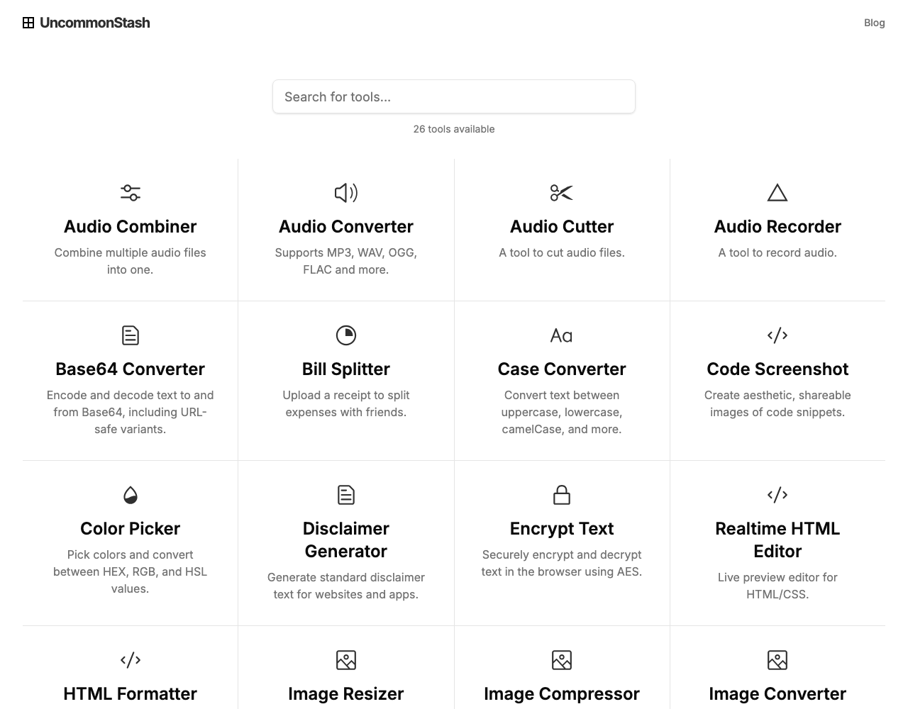

<p align="center">
  
</p>

<p align="center">
  Free online tools that run <strong>entirely in your browser</strong> — no uploads, no accounts, no server processing.
</p>

<p align="center">
  <a href="https://uncommonstash.com"><strong>Try all tools live</strong></a> •
  <a href="#tools">Browse tools</a> •
  <a href="#contributing">Contribute</a> •
  <a href="./LICENSE">MIT license</a>
</p>

## Why uncommonstash

- **Private by design** — your files never leave your device. Conversions run locally via WebAssembly (FFmpeg, ImageMagick, Tesseract).
- **Free forever, no sign-up** — every tool works the moment the page loads.
- **Works offline** — once loaded, most tools keep working without a connection.
- **Fast** — static site, no backend round-trips; heavy work stays on your machine.



## Tools

### 🎵 Audio

- [Audio Converter](https://uncommonstash.com/audio/convert) — MP3, WAV, OGG, FLAC and more
- [Audio Cutter](https://uncommonstash.com/audio/cut) — trim audio files
- [Audio Combiner](https://uncommonstash.com/audio/combine) — merge multiple files into one
- [Voice Recorder](https://uncommonstash.com/audio/recorder) — record audio in the browser

### 🖼️ Images & video

- [Image Converter](https://uncommonstash.com/images/convert) — JPG, PNG, HEIC, WEBP and more
- [Image Compressor](https://uncommonstash.com/images/compress) — shrink JPG/PNG without visible quality loss
- [Image Resizer](https://uncommonstash.com/image-resizer) — custom dimensions
- [Image to PDF](https://uncommonstash.com/images/to-pdf) — many images, one PDF
- [Video Converter](https://uncommonstash.com/videos/convert) — MP4, MOV, AVI and more

### ✍️ Text

- [Word Counter](https://uncommonstash.com/word-counter) — words, sentences, characters
- [Case Converter](https://uncommonstash.com/case-converter) — UPPER, lower, camelCase, snake_case…
- [Markdown to HTML](https://uncommonstash.com/markdown-to-html) — live dual-pane preview
- [Online Notepad](https://uncommonstash.com/online-notepad) — auto-saving scratchpad
- [Base64 Converter](https://uncommonstash.com/base64-converter) — standard and URL-safe variants
- [Encrypt Text](https://uncommonstash.com/encrypt-text) — AES encryption, client-side only

### 🧰 Web & everyday

- [QR Code Generator](https://uncommonstash.com/qr-code-generator) — QR codes for any URL or text
- [UTM Builder](https://uncommonstash.com/utm-builder) — campaign URLs with UTM parameters
- [HTML Editor](https://uncommonstash.com/html-editor) — live HTML/CSS preview
- [HTML Formatter](https://uncommonstash.com/html-formatter) — beautify or minify markup
- [Code Screenshot](https://uncommonstash.com/code-screenshot) — shareable code images
- [Token Generator](https://uncommonstash.com/token-generator) — passwords, UUIDs, API keys
- [Random Number Generator](https://uncommonstash.com/random-number-generator) — integers in any range
- [Text to Cron](https://uncommonstash.com/text-to-cron) — natural language to cron expressions
- [Bill Splitter](https://uncommonstash.com/bill-splitter) — scan a receipt, split expenses
- [Color Picker](https://uncommonstash.com/color-picker) — HEX, RGB, HSL conversion
- [Disclaimer Generator](https://uncommonstash.com/disclaimer-generator) — standard legal blurbs

Short on words? There's also a [blog](https://uncommonstash.com/blog) with notes on how some of these are built.

## Contributing

New tools and fixes welcome! You'll need Node.js 24 and pnpm 10.

```bash
pnpm install   # also generates the tool index + blog data
pnpm dev       # http://localhost:3000
pnpm test      # unit tests
pnpm lint && npx tsc -b
pnpm build     # static output in dist/
```

A tool is a folder under `src/pages/` with its component plus a `tool.yaml` (`name`, `description`, `ready`, `icon`) — that file is what puts it on the home page and in search. Pushes to `main` run CI and deploy to GitHub Pages automatically.

## License

MIT — see [LICENSE](./LICENSE).
